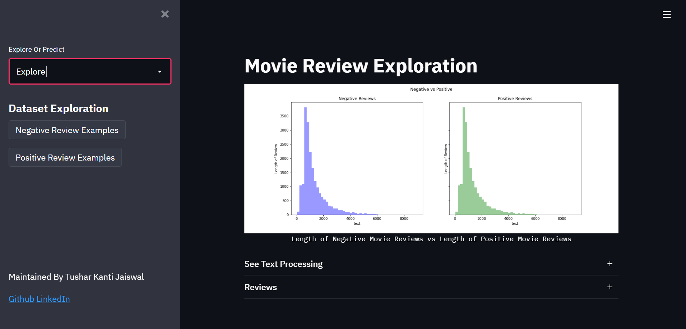
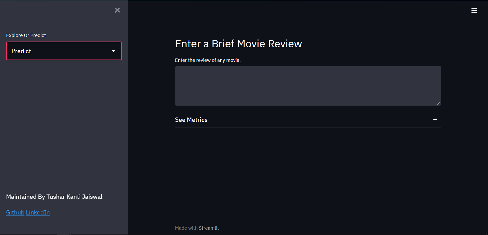

# Movie Review Analysis



## Background
This is a fun side project I did to make and deploy my first end to end Machine Learning project by using [NLP](https://en.wikipedia.org/wiki/Natural_language_processing) and using [Streamlit](https://docs.streamlit.io/en/stable/index.html) to make a web app in few steps.

## Table of contents
* [Python](#python)
  - [Text Processing Function](#Text-function)
  - [Model](#Model)
* [The Web App](#the-web-app)
  - [Streamlit](#Streamlit)
* [Deployment](#deployment)

## How it works
### Python
#### Text-function
We start with a number of texts or documents, which are in turn just arrays of charcters. The function first uses list comprehension to put together all those characters in a given document which are not punctuation marks after turning each character to lowercase. Then we use another python string function to make words or a sentence out of those characters. At last, all those words are returned which are not included in the nltk stopwrods and have more than 3 characters after [Stemming](https://en.wikipedia.org/wiki/Stemming).

```python
import string
from nltk.corpus import stopwords
from nltk.stem import PorterStemmer

porter = PorterStemmer()
def text_processing(data):
    nopunc = [i for i in data.lower() if i not in string.punctuation]
    nopunc = ''.join(nopunc)
    return [porter.stem(i) for i in nopunc.split() if i not in stopwords.words('English') and len(i)>3]
```


#### Model
We use the sckit-learn inbuilt CountVectoriser function which uses our text_processing function to tokenise each document and then the scikit-learn TfIdf transformer is called to convert an iterable of tokens into TF-IDF values. (TF-IDF, or term frequency - inverse document frequency, is a way to categorize each term in a document by its frequency of occurrence *within the document*, while reducing the importance of terms frequent *across all documents*). 
An instance of Multinomial Naive Bayes Classifier is called to Classify the dataframe returned by tfidf transformer into Negative or Positive movie reviews.

```python
from sklearn.feature_extraction.text import TfidfTransformer, CountVectorizer
from sklearn.naive_bayes import MultinomialNB
from sklearn.pipeline import Pipeline

sentiment = Pipeline([
    ('Bag Of Words', CountVectorizer(analyzer=text_processing)),
    ('tfidf', TfidfTransformer()),
    ('Bayes Classification', MultinomialNB())
])
```

We then trained the model on the training Dataset contained in Sentiment Folder. And Saved the model as a joblib file.

```python
sentiment.fit(df['text'], df['label'])
from joblib import dump, load
dump(sentiment, 'sentiment_analysis.joblib')
```

### The web-app
#### Streamlit
The Web App was built by simply using the streamlit library in python to create a front end using Markdown. The Explore page contains information regarding the training data set and the Predict page is used to input a movie review and classify it as Negative or Positive.
The Main App is as follows.

```python
import streamlit as st
from predict import predict
from explore import explore
from text_p import text_processing
import nltk
# nltk.data.path.append('/app/.heroku/python/nltk_data')


page = st.sidebar.selectbox("Explore Or Predict", ("Explore", "Predict"))


if page == "Predict":
    predict()
else:
    explore()

st.sidebar.markdown(
    """<div style='display: inline; position: fixed; bottom: 5%;'>
        <p style ='text-align: centre;'>Maintained By Tushar Kanti Jaiswal</p>
        <p style ='left: 10%'>
        <a href="https://github.com/tusharkj14" target="_blank">Github</a>
        <a href="https://www.linkedin.com/in/tushar-jaiswal14b/" target="_blank">LinkedIn</a>
        </p>
        </div>
    """,
    unsafe_allow_html=True,
)
```

The rest of the python programs also contain various Streamlit built in APIs to take input and show data and other things


### Deployment
The App is Deployed on the Heroku platform at [Web-App](https://movie-analysis-streamlit.herokuapp.com/)
Or else, the file can be run locally by using the `streamlit run app.py` command in the directory containing the app.py program.

1. The `Procfile` that's just the line `web: sh setup.sh && streamlit run app.py`.
  - This file tells Heroku to use `setup.sh` to serve our app, which is called `app` inside `app.py`, and to preload a worker before serving the app. Preloading causes Heroku's error logs to be much more informative.
2. The `requirements.txt` file contains the necessary packages for the app to run.
3. The `nltk.txt` file contains the lists of corpora from the nltk library you need to use.
